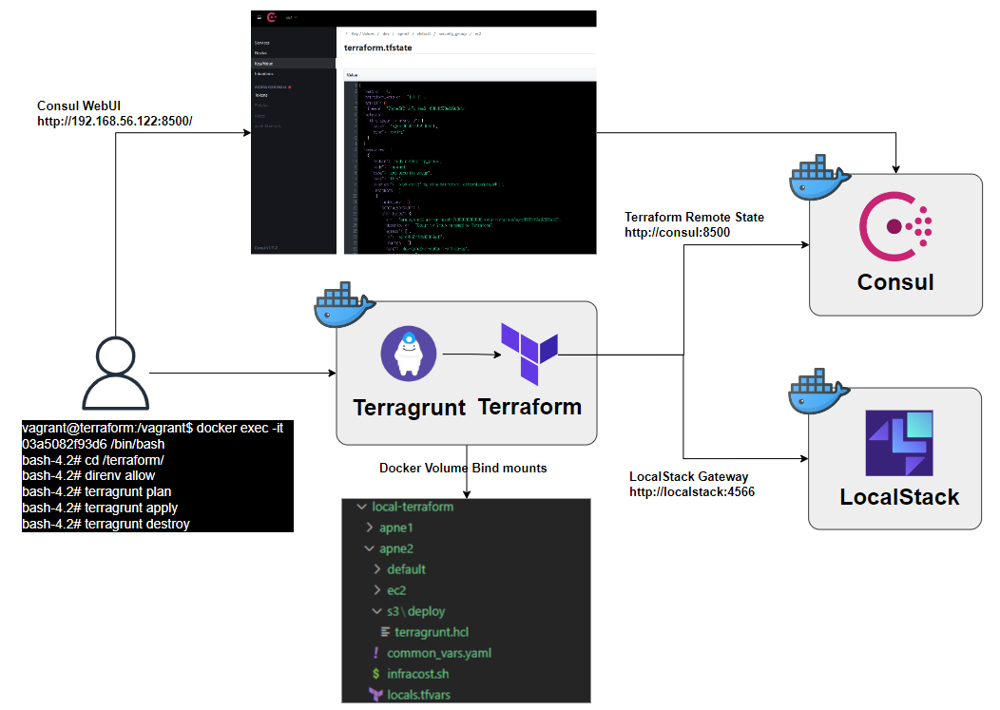
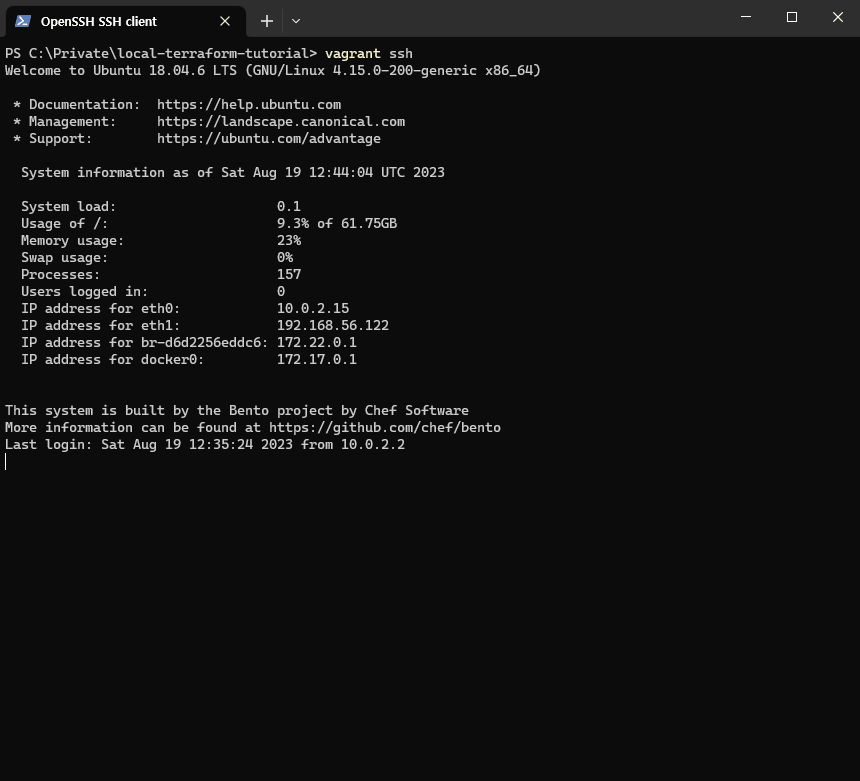
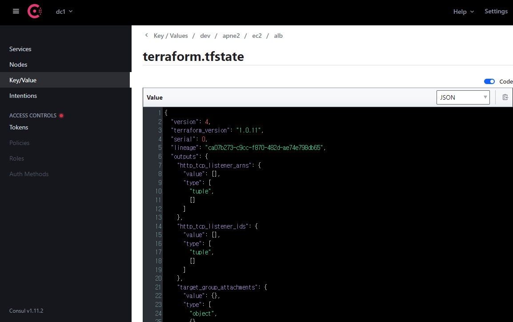
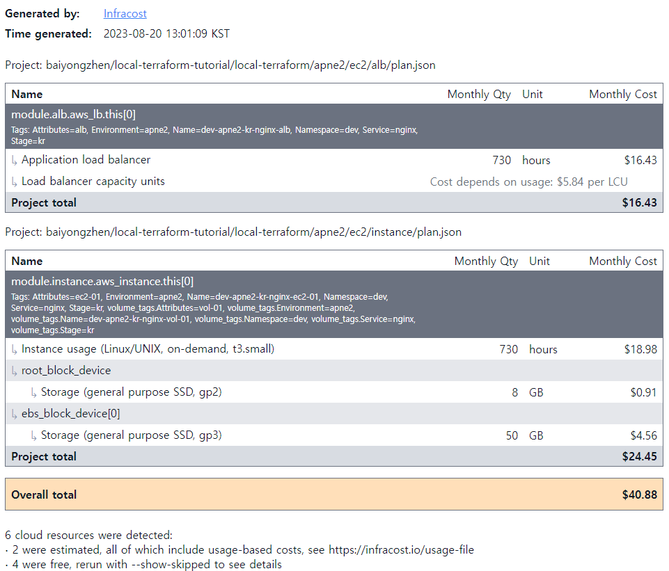
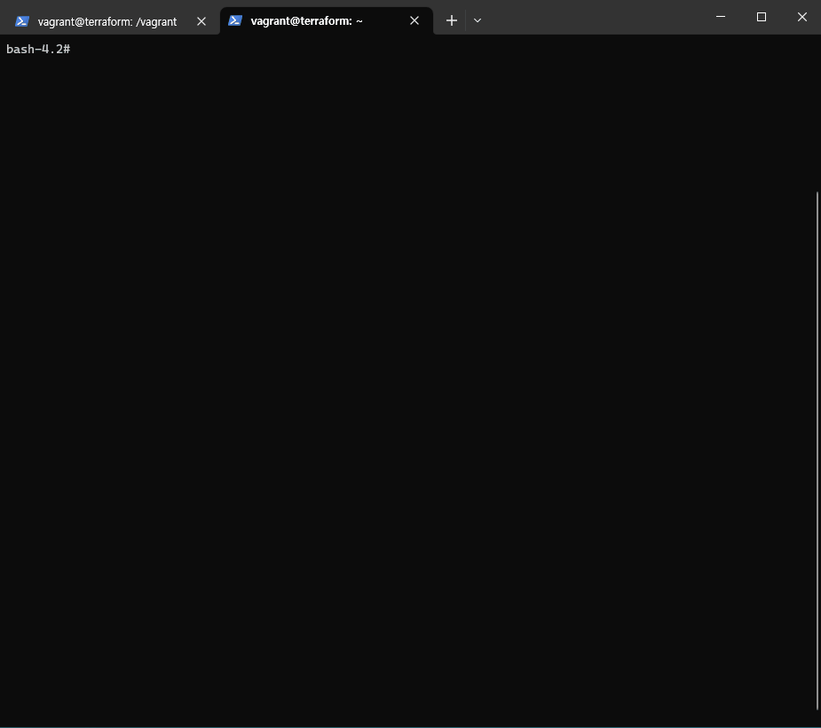

# 로컬 IaC(Infrastructure as Code)테스트 환경 구성하기

***[로컬 IaC(Infrastructure as Code)테스트 환경 구성하기](https://medium.com/@dudwls96/%EB%A1%9C%EC%BB%AC-iac-infrastructure-as-code-%ED%85%8C%EC%8A%A4%ED%8A%B8-%ED%99%98%EA%B2%BD-%EA%B5%AC%EC%84%B1%ED%95%98%EA%B8%B0-1261aa0542a9)***


# 전체 구성


테스트 환경 구성을 위한 오픈소스:
- Vagrant
- Docker & Docker Compose
- LocalStack
- Consul
- Terraform
- Terragrunt
- tfswitch
- tgswitch
- direnv
- InfraCost
- Checkov


# Vagrant 통한 환경 구성

```bash
Host PC에 VirtualBox, Vagrant 설치 되어 있어야 합니다.
git clone https://github.com/baiyongzhen/local-terraform-tutorial.git
cd local-terraform-tutorial
# Vagrant 실행
vagrant up
vagrant ssh
cd /vagrant
# 로컬 환경 구성
docker-compose up -d
docker ps -a
```

# Docker 통한 환경 구성
docker-compose.yaml 파일을 수정합니다.
```yaml
  consul:
    #image: consul:
    image: hashicorp/consul:1.11.2
    container_name: consul
    restart: always
    volumes:
      - <your-host-dir>:/consul/config
      - <your-host-dir>:/consul/data
      - <your-host-dir>:/consul/logs

  localstack:
    image: localstack/localstack:2.2
    container_name: localstack
..
    volumes:
      - "<your-host-dir>:/var/lib/localstack"
      - "/var/run/docker.sock:/var/run/docker.sock"

# docker compose 실행하세요
docker-compose up -d
docker ps -a
```

# Terragrunt Plan,Apply,Destory


# Terraform Remote State (Consul)


# InfraCost 비용 리포트


# Checkov 보안 및 권장사항 검사


# 참고사이트
- https://developer.hashicorp.com/terraform/language/settings/backends/consul
- https://localstack.cloud/
- https://github.com/localstack/localstack
- https://github.com/direnv/direnv
- https://github.com/infracost/infracost
- https://github.com/bridgecrewio/checkov